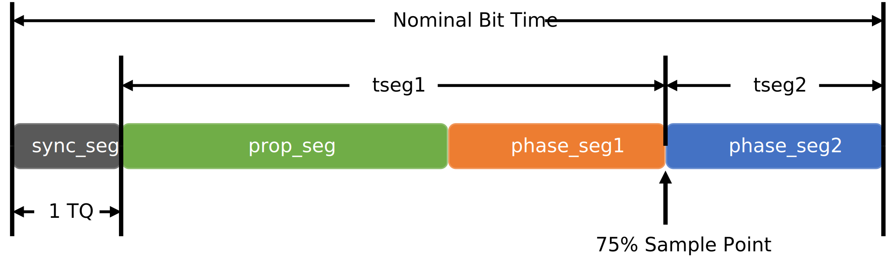
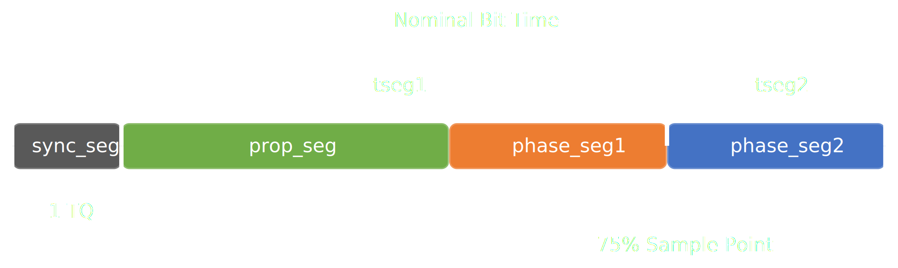

Bit Timing Configuration
========================

.. attention::
    This feature is experimental. The implementation might change in future
    versions.

The CAN protocol, specified in ISO 11898, allows the bitrate, sample point
and number of samples to be optimized for a given application. These
parameters, known as bit timings, can be adjusted to meet the requirements
of the communication system and the physical communication channel.

These parameters include:

* **tseg1**: The time segment 1 (TSEG1) is the amount of time from the end
  of the sync segment until the sample point. It is expressed in time quanta (TQ).
* **tseg2**: The time segment 2 (TSEG2) is the amount of time from the
  sample point until the end of the bit. It is expressed in TQ.
* **sjw**: The synchronization jump width (SJW) is the maximum number
  of TQ that the controller can resynchronize every bit.
* **sample point**: The sample point is defined as the point in time
  within a bit where the bus controller samples the bus for dominant or
  recessive levels. It is typically expressed as a percentage of the bit time.
  The sample point depends on the bus length and propagation time as well
  as the information processing time of the nodes.

   Bit Timing and Sample Point

For example, consider a bit with a total duration of 8 TQ and a sample
point at 75%. The values for TSEG1, TSEG2 and SJW would be 5, 2, and 2,
respectively. The sample point would be 6 TQ after the start of the bit,
leaving 2 TQ for the information processing by the bus nodes.

.. note::
   The values for TSEG1, TSEG2 and SJW are chosen such that the
   sample point is at least 50% of the total bit time. This ensures that
   there is sufficient time for the signal to stabilize before it is sampled.

.. note::
   In CAN FD, the arbitration (nominal) phase and the data phase can have
   different bit rates. As a result, there are two separate sample points
   to consider.

Another important parameter is **f_clock**: The CAN system clock frequency
in Hz. This frequency is used to derive the TQ size from the bit rate.
The relationship is ``f_clock = (tseg1+tseg2+1) * bitrate * brp``.
The bit rate prescaler value **brp** is usually determined by the controller
and is chosen to ensure that the resulting bit time is an integer value.
Typical CAN clock frequencies are 8-80 MHz.

In most cases, the recommended settings for a predefined set of common
bit rates will work just fine. In some cases, however, it may be necessary
to specify custom bit timings. The :class:`~can.BitTiming` and
:class:`~can.BitTimingFd` classes can be used for this purpose to specify
bit timings in a relatively interface agnostic manner.

:class:`~can.BitTiming` or :class:`~can.BitTimingFd` can also help you to
produce an overview of possible bit timings for your desired bit rate:

    >>> import contextlib
    >>> import can
    ...
    >>> timings = set()
    >>> for sample_point in range(50, 100):
    ...     with contextlib.suppress(ValueError):
    ...         timings.add(
    ...             can.BitTiming.from_sample_point(
    ...                 f_clock=8_000_000,
    ...                 bitrate=250_000,
    ...                 sample_point=sample_point,
    ...             )
    ...         )
    ...
    >>> for timing in sorted(timings, key=lambda x: x.sample_point):
    ...     print(timing)
    BR: 250_000 bit/s, SP: 50.00%, BRP: 2, TSEG1: 7, TSEG2: 8, SJW: 4, BTR: C176h, CLK: 8MHz
    BR: 250_000 bit/s, SP: 56.25%, BRP: 2, TSEG1: 8, TSEG2: 7, SJW: 4, BTR: C167h, CLK: 8MHz
    BR: 250_000 bit/s, SP: 62.50%, BRP: 2, TSEG1: 9, TSEG2: 6, SJW: 4, BTR: C158h, CLK: 8MHz
    BR: 250_000 bit/s, SP: 68.75%, BRP: 2, TSEG1: 10, TSEG2: 5, SJW: 4, BTR: C149h, CLK: 8MHz
    BR: 250_000 bit/s, SP: 75.00%, BRP: 2, TSEG1: 11, TSEG2: 4, SJW: 4, BTR: C13Ah, CLK: 8MHz
    BR: 250_000 bit/s, SP: 81.25%, BRP: 2, TSEG1: 12, TSEG2: 3, SJW: 3, BTR: 812Bh, CLK: 8MHz
    BR: 250_000 bit/s, SP: 87.50%, BRP: 2, TSEG1: 13, TSEG2: 2, SJW: 2, BTR: 411Ch, CLK: 8MHz
    BR: 250_000 bit/s, SP: 93.75%, BRP: 2, TSEG1: 14, TSEG2: 1, SJW: 1, BTR: 010Dh, CLK: 8MHz

It is possible to specify CAN 2.0 bit timings
using the config file:

.. code-block:: none

    [default]
    f_clock=8000000
    brp=1
    tseg1=5
    tseg2=2
    sjw=1
    nof_samples=1

The same is possible for CAN FD:

.. code-block:: none

    [default]
    f_clock=80000000
    nom_brp=1
    nom_tseg1=119
    nom_tseg2=40
    nom_sjw=40
    data_brp=1
    data_tseg1=29
    data_tseg2=10
    data_sjw=10

A :class:`dict` of the relevant config parameters can be easily obtained by calling
``dict(timing)`` or ``{**timing}`` where ``timing`` is the :class:`~can.BitTiming` or
:class:`~can.BitTimingFd` instance.

Check :doc:`configuration` for more information about saving and loading configurations.

.. autoclass:: can.BitTiming
    :class-doc-from: both
    :show-inheritance:
    :members:
    :member-order: bysource

.. autoclass:: can.BitTimingFd
    :class-doc-from: both
    :show-inheritance:
    :members:
    :member-order: bysource
