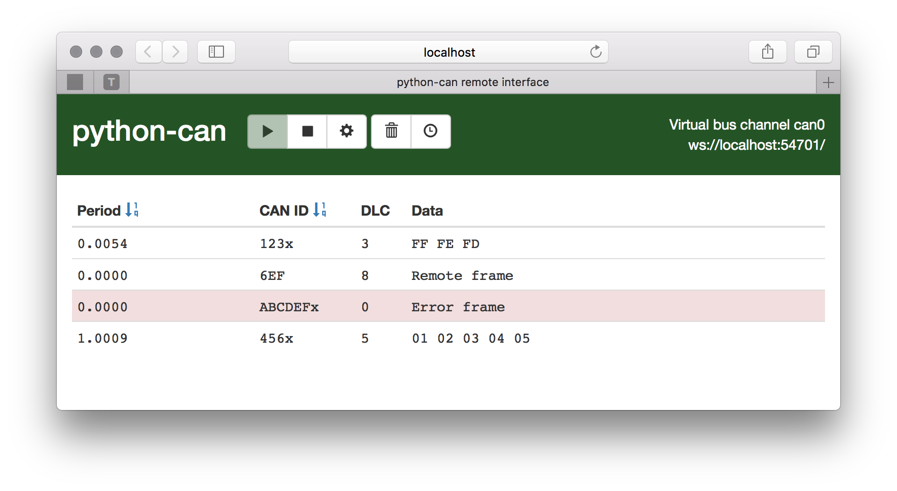

Remote
======

The remote interface works as a networked bridge between the computer running
the application and the computer owning the physical CAN interface.

Multiple clients may connect to the same server simultaneously. Each client
will create its own bus instance on the server, so this must be supported by the
real interface.

.. warning::

    The server has no security measures implemented.
    Anyone with network access to the computer will be able to send and receive
    messages and potentially find exploits to get access to the computer.
    Make sure you are on a trusted and secure network before you enable it.

Server
------

The computer which owns the CAN interface must start a server which accepts
incoming connections. If more than one channel is to be shared, multiple
servers must be started on different ports.

Start a server using default interface and channel::

    $ python -m can.server

Specify interface, channel and port number explicitly::

    $ python -m can.server --interface kvaser --channel 0 --port 54702

Client
------

The application must specify ``remote`` as interface and ``ws://host:port/`` as
channel. Any other configuration options will be passed to the real bus
interface.

.. code-block:: python

    bus = can.interface.Bus('ws://192.168.0.10:54701/',
                            bustype='remote',
                            bitrate=500000,
                            can_filters=[
                                {'can_id': 0x11},
                                {'can_mask': 0xff}
                            ])

Alternatively in a .canrc file::

    [default]
    interface = remote
    channel = ws://myhostname:54701/

The logger script could be started like this::

    $ python -m can.logger -i remote -c ws://myhostname:54701/

Web interface
-------------

A basic web interface for inspecting the CAN traffic is available on the
same address using HTTP, e.g. http://myhostname:54701/.

Internals
---------

The client uses a standard Bus class to connect to the server.

.. autoclass:: can.interfaces.remote.RemoteBus
.. autoexception:: can.interfaces.remote.RemoteError

The server uses the following classes to implement the connections.

.. autoclass:: can.interfaces.remote.RemoteServer

   .. method:: serve_forever(poll_interval=0.5)

      Start listening for incoming connections.

   .. method:: shutdown

      Stops the serve_forever loop.

      Blocks until the loop has finished. This must be called while
      serve_forever() is running in another thread, or it will
      deadlock.

   .. method:: server_close

      Clean-up the server.

WebSocket + JSON Protocol
~~~~~~~~~~~~~~~~~~~~~~~~~

The protocol is a stream of events over a WebSocket encoded as JSON.
When connecting using WebSocket, "can.json.v1" should be specified as protocol.

Each event is represented as an object with a "type" and a "payload" key:

.. code-block:: json

    {
        "type": "event_name",
        "payload": null
    }

The client starts with sending a "bus_request".
Any config options may be passed in the payload.

.. code-block:: json

    {
        "type": "bus_request",
        "payload": {
            "config": {
                "receive_own_messages": true,
                "bitrate": 500000,
                "can_filters": [
                    {
                        "can_id": 123,
                        "can_mask": 4095
                    }
                ]
            }
        }
    }

The server will reply with a "bus_response" on success:

.. code-block:: json

    {
        "type": "bus_response",
        "payload": {
            "channel_info": "Name of channel"
        }
    }

At any time the server may send an "error" event:

.. code-block:: json

    {
        "type": "error",
        "payload": "Error description"
    }

A CAN message may be sent or received from either end. If any keys are omitted,
they will get a default value from the :class:`can.Message` constructor.

.. code-block:: json

    {
        "type": "message",
        "payload": {
            "timestamp": 1501531012.1999,
            "arbitration_id": 123,
            "extended_id": false,
            "is_remote_frame": false,
            "is_error_frame": false,
            "dlc": 8,
            "data": [1, 2, 3, 4, 5, 6, 7, 8],
        }
    }

Periodic transmissions may be started and stopped with "periodic_start" and
"periodic_stop". Subsequent "periodic_start" with the same arbitration ID will
modify any existing periodic task.

.. code-block:: json

    {
        "type": "periodic_start",
        "payload": {
            "period": 0.01,
            "duration": null,
            "msg": {
                "arbitration_id": 123,
                "extended_id": false,
                "data": [1, 2, 3, 4, 5, 6, 7, 8],
            }
        }
    }

.. code-block:: json

    {
        "type": "periodic_stop",
        "payload": 123
    }

Binary + JSON Protocol
~~~~~~~~~~~~~~~~~~~~~~

In order to save bandwidth on high traffic CAN buses, a binary CAN message can
be transmitted over the WebSocket in addition to the JSON format.
The WebSocket client should request "can.binary+json.v1" as protocol if it
supports receiving binary messages.

+--------+-------+--------------------------------------------------------+
| Byte   | Type  | Contents                                               |
+========+=======+========================================================+
| 0      | U8    | Message event type (= 1)                               |
+--------+-------+--------------------------------------------------------+
| 1 - 8  | F64   | Timestamp                                              |
+--------+-------+--------------------------------------------------------+
| 9 - 12 | U32   | Arbitration ID                                         |
+--------+-------+--------------------------------------------------------+
| 13     | U8    | DLC                                                    |
+--------+-------+--------------------------------------------------------+
| 14     | U8    | Flags:                                                 |
|        |       |  - Bit 0: Extended ID                                  |
|        |       |  - Bit 1: Remote frame                                 |
|        |       |  - Bit 2: Error frame                                  |
+--------+-------+--------------------------------------------------------+
| 15 -   | U8    | Data (rest of payload)                                 |
+--------+-------+--------------------------------------------------------+

