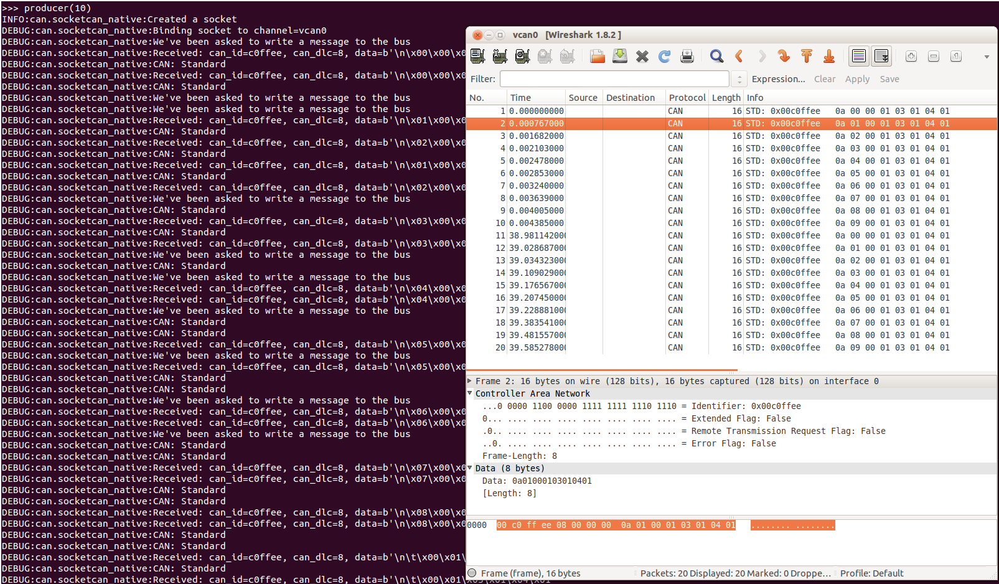

.. _SocketCAN:

SocketCAN
=========

The SocketCAN documentation can be found in the `Linux kernel docs`_ in the
``networking`` directory. Quoting from the SocketCAN Linux documentation:

   The socketcan package is an implementation of CAN protocols
   (Controller Area Network) for Linux.  CAN is a networking technology
   which has widespread use in automation, embedded devices, and
   automotive fields.  While there have been other CAN implementations
   for Linux based on character devices, SocketCAN uses the Berkeley
   socket API, the Linux network stack and implements the CAN device
   drivers as network interfaces.  The CAN socket API has been designed
   as similar as possible to the TCP/IP protocols to allow programmers,
   familiar with network programming, to easily learn how to use CAN
   sockets.

.. important::

    `python-can` versions before 2.2 had two different implementations named
    ``socketcan_ctypes`` and ``socketcan_native``. These were removed in
    version 4.0.0 after a deprecation period.

Socketcan Quickstart
--------------------

The CAN network driver provides a generic
interface to setup, configure and monitor CAN devices. To configure
bit-timing parameters use the program ``ip``.

The virtual CAN driver (vcan)
~~~~~~~~~~~~~~~~~~~~~~~~~~~~~

The virtual CAN interfaces allow the transmission and reception of CAN
frames without real CAN controller hardware. Virtual CAN network devices
are usually named 'vcanX', like vcan0 vcan1 vcan2.

To create a virtual can interface using socketcan run the following:

.. code-block:: bash

    sudo modprobe vcan
    # Create a vcan network interface with a specific name
    sudo ip link add dev vcan0 type vcan
    sudo ip link set vcan0 up

Real Device
~~~~~~~~~~~

``vcan`` should be substituted for ``can`` and ``vcan0`` should be
substituted for ``can0`` if you are using real hardware. Setting the
bitrate can also be done at the same time, for example to enable an
existing ``can0`` interface with a bitrate of 1MB:

.. code-block:: bash

    sudo ip link set can0 up type can bitrate 1000000

CAN over Serial / SLCAN
~~~~~~~~~~~~~~~~~~~~~~~

SLCAN adapters can be used directly via :doc:`/interfaces/slcan`, or
via :doc:`/interfaces/socketcan` with some help from the ``slcand`` utility
which can be found in the `can-utils <https://github.com/linux-can/can-utils>`_ package.

To create a socketcan interface for an SLCAN adapter run the following:

.. code-block:: bash

    slcand -f -o -c -s5 /dev/ttyAMA0
    ip link set up slcan0

Names of the interfaces created by ``slcand`` match the ``slcan\d+`` regex.
If a custom name is required, it can be specified as the last argument. E.g.:

.. code-block:: bash

    slcand -f -o -c -s5 /dev/ttyAMA0 can0
    ip link set up can0

.. _socketcan-pcan:

PCAN
~~~~

Kernels >= 3.4 supports the PCAN adapters natively via :doc:`/interfaces/socketcan`,
so there is no need to install any drivers. The CAN interface can be brought like so:

::

    sudo modprobe peak_usb
    sudo modprobe peak_pci
    sudo ip link set can0 up type can bitrate 500000

Intrepid
~~~~~~~~

The Intrepid Control Systems, Inc provides several devices (e.g. ValueCAN) as well
as Linux module and user-space daemon to make it possible to use them via SocketCAN.

Refer to below repositories for installation instructions:

- `Intrepid kernel module`_
- `Intrepid user-space daemon`_

Send Test Message
^^^^^^^^^^^^^^^^^

The `can-utils`_ library for Linux includes a `cansend` tool which is useful to
send known payloads. For example to send a message on `vcan0`:

.. code-block:: bash

    cansend vcan0 123#DEADBEEF

CAN Errors
^^^^^^^^^^

A device may enter the "bus-off" state if too many errors occurred on
the CAN bus. Then no more messages are received or sent. An automatic
bus-off recovery can be enabled by setting the "restart-ms" to a
non-zero value, e.g.:

.. code-block:: bash

    sudo ip link set canX type can restart-ms 100

Alternatively, the application may realize the "bus-off" condition by
monitoring CAN error frames and do a restart when appropriate with the
command:

.. code-block:: bash

    ip link set canX type can restart

Note that a restart will also create a CAN error frame.

List network interfaces
~~~~~~~~~~~~~~~~~~~~~~~

To reveal the newly created ``can0`` or a ``vcan0`` interface:

.. code-block:: bash

    ifconfig

Display CAN statistics
~~~~~~~~~~~~~~~~~~~~~~

.. code-block:: bash

    ip -details -statistics link show vcan0

Network Interface Removal
~~~~~~~~~~~~~~~~~~~~~~~~~

To remove the network interface:

.. code-block:: bash

    sudo ip link del vcan0

Wireshark
---------

Wireshark supports socketcan and can be used to debug *python-can*
messages. Fire it up and watch your new interface.

To spam a bus:

.. code-block:: python

    import time
    import can

    bustype = 'socketcan'
    channel = 'vcan0'

    def producer(id):
        """:param id: Spam the bus with messages including the data id."""
        bus = can.Bus(channel=channel, interface=bustype)
        for i in range(10):
            msg = can.Message(arbitration_id=0xc0ffee, data=[id, i, 0, 1, 3, 1, 4, 1], is_extended_id=False)
            bus.send(msg)
        
        time.sleep(1)

    producer(10)

With debugging turned right up this looks something like this:

The process to follow bus traffic is even easier:

.. code-block:: python

    for message in Bus(can_interface):
        print(message)

Reading and Timeouts
--------------------

Reading a single CAN message off of the bus is simple with the ``bus.recv()``
function:

.. code-block:: python

    import can

    bus = can.Bus(channel='vcan0', interface='socketcan')
    message = bus.recv()

By default, this performs a blocking read, which means ``bus.recv()`` won't
return until a CAN message shows up on the socket. You can optionally perform a
blocking read with a timeout like this:

.. code-block:: python

    message = bus.recv(1.0)  # Timeout in seconds.

    if message is None:
        print('Timeout occurred, no message.')

If you set the timeout to ``0.0``, the read will be executed as non-blocking,
which means ``bus.recv(0.0)`` will return immediately, either with a ``Message``
object or ``None``, depending on whether data was available on the socket.

Filtering
---------

The implementation features efficient filtering of can_id's. That filtering
occurs in the kernel and is much much more efficient than filtering messages
in Python.

Broadcast Manager
-----------------

The ``socketcan`` interface implements thin wrappers to the linux `broadcast manager`
socket api. This allows the cyclic transmission of CAN messages at given intervals.
The overhead for periodic message sending is extremely low as all the heavy lifting occurs
within the linux kernel.

The :class:`~can.BusABC` initialized for `socketcan` interface transparently handles
scheduling of CAN messages to Linux BCM via :meth:`~can.BusABC.send_periodic`:

.. code-block:: python

    with can.interface.Bus(interface="socketcan", channel="can0") as bus:
        task = bus.send_periodic(...)

More examples that uses :meth:`~can.BusABC.send_periodic` are included
in ``python-can/examples/cyclic.py``.

The `task` object returned by :meth:`~can.BusABC.send_periodic` can be used to halt,
alter or cancel the periodic message task:

.. autoclass:: can.interfaces.socketcan.CyclicSendTask
    :members:

Buffer Sizes
------------

Currently, the sending buffer size cannot be adjusted by this library.
However, `this issue <https://github.com/hardbyte/python-can/issues/657#issuecomment-516504797>`__ describes how to change it via the command line/shell.

Bus
---

The :class:`~can.interfaces.socketcan.SocketcanBus` specializes :class:`~can.BusABC`
to ensure usage of SocketCAN Linux API. The most important differences are:

- usage of SocketCAN BCM for periodic messages scheduling;
- filtering of CAN messages on Linux kernel level;
- usage of nanosecond timings from the kernel.

.. autoclass:: can.interfaces.socketcan.SocketcanBus
    :members:
    :inherited-members:

.. External references

.. _Linux kernel docs: https://www.kernel.org/doc/Documentation/networking/can.txt
.. _Intrepid kernel module: https://github.com/intrepidcs/intrepid-socketcan-kernel-module
.. _Intrepid user-space daemon: https://github.com/intrepidcs/icsscand
.. _can-utils: https://github.com/linux-can/can-utils
