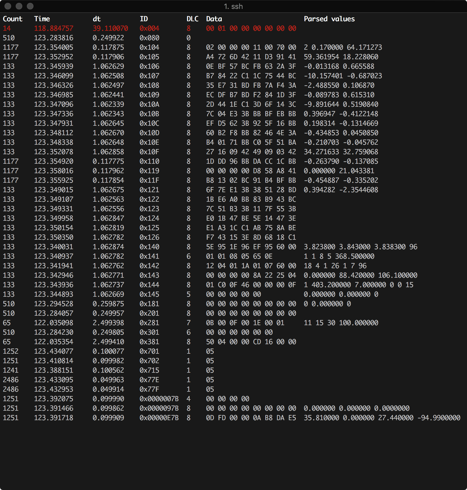

Scripts
=======

The following modules are callable from python-can.

They can be called for example by ``python -m can.logger`` or ``can_logger.py`` (if installed using pip).

can.logger
----------

Command line help, called with ``--help``:

.. command-output:: python -m can.logger -h

can.player
----------

.. command-output:: python -m can.player -h

can.viewer
----------

A screenshot of the application can be seen below:

The first column is the number of times a frame with the particular ID that has been received, next is the timestamp of the frame relative to the first received message. The third column is the time between the current frame relative to the previous one. Next is the length of the frame, the data and then the decoded data converted according to the ``-d`` argument. The top red row indicates an error frame.

Command line arguments
^^^^^^^^^^^^^^^^^^^^^^

By default the ``can.viewer`` uses the :doc:`/interfaces/socketcan` interface. All interfaces are supported and can be specified using the ``-i`` argument or configured following :doc:`/configuration`.

The full usage page can be seen below:

.. command-output:: python -m can.viewer -h

